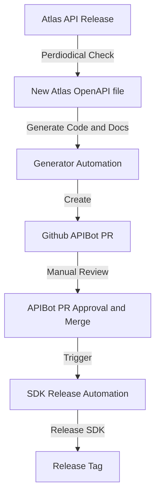

# SDK OpenAPI Tools

Folder contains scripts, generators and other files required to generate Golang SDK

## Purpose of the project

Tools provides required scripts and infrastructure for generating source code for [OpenAPI generator project](https://github.com/OpenAPITools/openapi-generator).
Typically a SDK is generated by:

1. Fetching OpenAPI file from different sources
2. Running [transformation](./transformer)) that will process OpenAPI file to simplify outputs of the generated SDKs
3. Generating SDK source code
4. Validation and linting for generation process

## Tools folder structure

- `config` - OpenAPI generator config
- `releaser` - release automation scripts and documentation
- `transformer` - OpenAPI transformation engine and it's documentation

## SDK Generation Workflow



1. **Fetch File**: We Periodically Fetch for the Changes in the Public OpenAPI file

2. **Generate Code and Docs**: The next step involves generating code and documentation based on the contents of the OpenAPI file. This is an automated process done by github actions.

3. **Create PR**: After the code and documentation are generated, a pull request (PR) is created on GitHub. The purpose of this PR is to visualize all changes before merging them to the main branch.

4. **Manual Review**: The pull request undergoes manual review by by the assigned team. The reviewers check the changes, verify their correctness, and assess their impact based on the PR description.

5. **APIBot PR Approval and Merge**: If the manual review is successful, and the changes are approved, the pull request is merged into the main repository.

6. **Trigger SDK Release Automation**: The successful merge of the pull request triggers the next step, which is the SDK Release Automation process.

7. **Release SDK**: SDK is released by creating Github Release.

## Manual Testing SDK Generation Workflow

### Fetching OpenAPI file

```bash
make fetch_openapi
```

### Generating Go SDK

```bash
make clean_and_generate
```

## Contributing

See [Contributing](./CONTRIBUTING.md) guide
